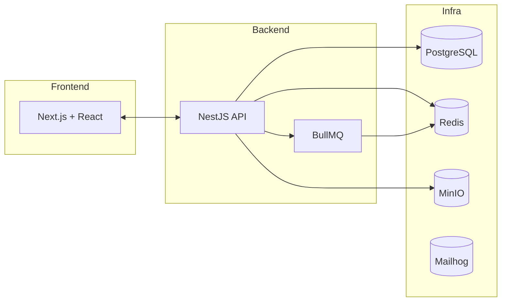
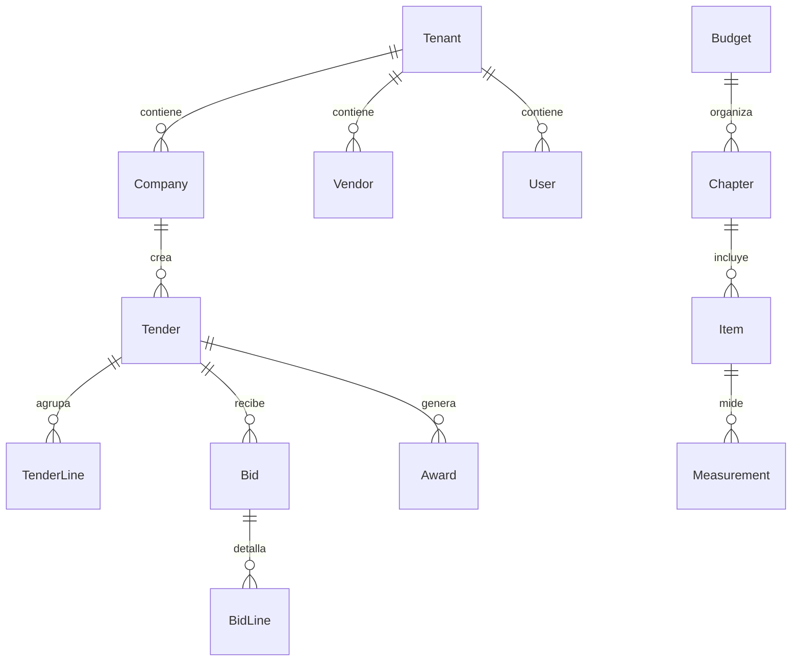

# Arquitectura de Build

```mermaid
flowchart LR
  subgraph Frontend
    NextJS[Next.js + React]
  end
  subgraph Backend
    Nest[NestJS API]
    Queue[BullMQ]
  end
  subgraph Infra
    Postgres[(PostgreSQL)]
    Redis[(Redis)]
    Minio[(MinIO)]
    Mailhog[(Mailhog)]
  end
  NextJS <--> Nest
  Nest --> Postgres
  Nest --> Redis
  Nest --> Minio
  Nest --> Queue
  Queue --> Redis
```

```mermaid
erDiagram
  Tenant ||--o{ Company : contiene
  Tenant ||--o{ Vendor : contiene
  Tenant ||--o{ User : contiene
  Company ||--o{ Tender : crea
  Tender ||--o{ TenderLine : agrupa
  Tender ||--o{ Bid : recibe
  Bid ||--o{ BidLine : detalla
  Tender ||--o{ Award : genera
  Budget ||--o{ Chapter : organiza
  Chapter ||--o{ Item : incluye
  Item ||--o{ Measurement : mide
```
